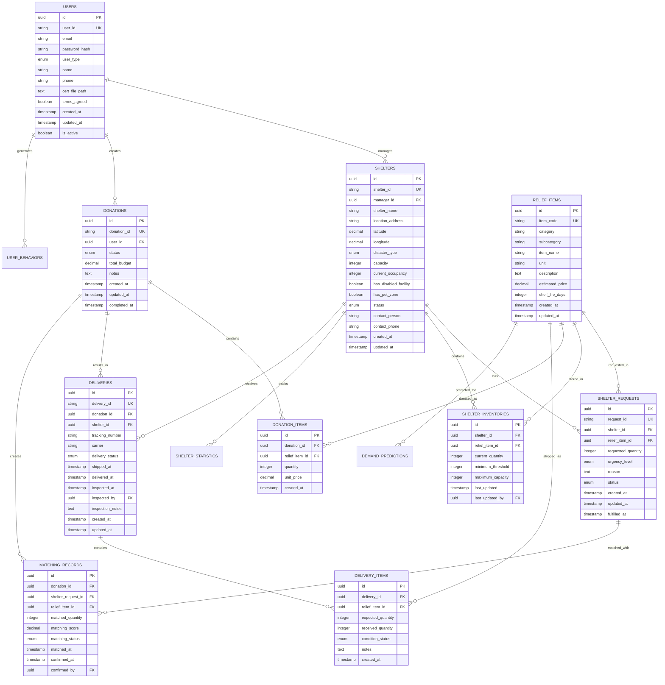

# 이어드림 데이터 스키마 구조 설계서

## 1. 개요

이어드림은 재난 대피소 구호품 관리 및 기부 매칭 플랫폼으로, 다변량 LSTM 예측 모델과 트위터 오픈소스 추천 알고리즘을 활용하여 효율적인 구호품 수급 예측 및 기부 매칭 서비스를 제공합니다.

### 1.1 핵심 기능

* 사용자 인증 및 관리 (공무원/일반사용자)

* 대피소 정보 관리 및 통계

* 구호품 재고 관리 및 요청

* 기부 희망 구호품 등록 및 매칭

* 배송 관리 및 검수

* AI 기반 구호품 수요 예측

* 추천 알고리즘 기반 매칭

### 1.2 AI/ML 모델 요구사항

* **다변량 LSTM 예측 모델**: 구호품 수요 예측을 위한 시계열 데이터

* **트위터 오픈소스 추천 알고리즘**: 사용자 행동 기반 매칭 최적화

## 2. 전체 데이터베이스 스키마 구조



## 3. AI/ML 모델을 위한 특화 테이블

### 3.1 시계열 데이터 (LSTM 예측 모델용)


### 3.2 사용자 행동 데이터 (추천 알고리즘용)


## 4. 핵심 테이블 상세 정의

### 4.1 사용자 관리 (AUTH00, AUTH01)

```sql
-- 사용자 테이블
CREATE TABLE users (
    id UUID PRIMARY KEY DEFAULT gen_random_uuid(),
    user_id VARCHAR(100) UNIQUE NOT NULL,
    email VARCHAR(255) UNIQUE NOT NULL,
    password_hash VARCHAR(255) NOT NULL,
    user_type VARCHAR(20) NOT NULL CHECK (user_type IN ('public_officer', 'general_user')),
    name VARCHAR(100) NOT NULL,
    phone VARCHAR(20),
    cert_file_path TEXT,
    terms_agreed BOOLEAN NOT NULL DEFAULT FALSE,
    created_at TIMESTAMP WITH TIME ZONE DEFAULT NOW(),
    updated_at TIMESTAMP WITH TIME ZONE DEFAULT NOW(),
    is_active BOOLEAN DEFAULT TRUE
);

-- 인덱스
CREATE INDEX idx_users_user_type ON users(user_type);
CREATE INDEX idx_users_created_at ON users(created_at);
```

### 4.2 대피소 관리 (OFFC00, OFFC01)

```sql
-- 대피소 테이블
CREATE TABLE shelters (
    id UUID PRIMARY KEY DEFAULT gen_random_uuid(),
    shelter_id VARCHAR(50) UNIQUE NOT NULL,
    manager_id UUID REFERENCES users(id),
    shelter_name VARCHAR(200) NOT NULL,
    location_address TEXT NOT NULL,
    latitude DECIMAL(10, 8),
    longitude DECIMAL(11, 8),
    disaster_type VARCHAR(20) NOT NULL CHECK (disaster_type IN ('지진', '화재', '홍수', '태풍', '기타')),
    capacity INTEGER NOT NULL CHECK (capacity > 0),
    current_occupancy INTEGER NOT NULL DEFAULT 0 CHECK (current_occupancy >= 0),
    has_disabled_facility BOOLEAN DEFAULT FALSE,
    has_pet_zone BOOLEAN DEFAULT FALSE,
    status VARCHAR(20) NOT NULL CHECK (status IN ('운영중', '포화', '폐쇄')),
    contact_person VARCHAR(100) NOT NULL,
    contact_phone VARCHAR(20) NOT NULL,
    created_at TIMESTAMP WITH TIME ZONE DEFAULT NOW(),
    updated_at TIMESTAMP WITH TIME ZONE DEFAULT NOW()
);

-- 인덱스
CREATE INDEX idx_shelters_disaster_type ON shelters(disaster_type);
CREATE INDEX idx_shelters_status ON shelters(status);
CREATE INDEX idx_shelters_location ON shelters(latitude, longitude);
```

### 4.3 구호품 관리 (OFFC02, OFFC03)

```sql
-- 구호품 마스터 테이블
CREATE TABLE relief_items (
    id UUID PRIMARY KEY DEFAULT gen_random_uuid(),
    item_code VARCHAR(50) UNIQUE NOT NULL,
    category VARCHAR(50) NOT NULL,
    subcategory VARCHAR(50) NOT NULL,
    item_name VARCHAR(200) NOT NULL,
    unit VARCHAR(20) NOT NULL,
    description TEXT,
    estimated_price DECIMAL(10, 2),
    shelf_life_days INTEGER,
    created_at TIMESTAMP WITH TIME ZONE DEFAULT NOW(),
    updated_at TIMESTAMP WITH TIME ZONE DEFAULT NOW()
);

-- 대피소 구호품 요청 테이블
CREATE TABLE shelter_requests (
    id UUID PRIMARY KEY DEFAULT gen_random_uuid(),
    request_id VARCHAR(50) UNIQUE NOT NULL,
    shelter_id UUID REFERENCES shelters(id),
    relief_item_id UUID REFERENCES relief_items(id),
    requested_quantity INTEGER NOT NULL CHECK (requested_quantity > 0),
    urgency_level VARCHAR(10) NOT NULL CHECK (urgency_level IN ('높음', '중간', '낮음')),
    reason TEXT,
    status VARCHAR(20) NOT NULL DEFAULT '대기중' CHECK (status IN ('대기중', '매칭중', '완료', '취소')),
    created_at TIMESTAMP WITH TIME ZONE DEFAULT NOW(),
    updated_at TIMESTAMP WITH TIME ZONE DEFAULT NOW(),
    fulfilled_at TIMESTAMP WITH TIME ZONE
);

-- 대피소 재고 테이블
CREATE TABLE shelter_inventories (
    id UUID PRIMARY KEY DEFAULT gen_random_uuid(),
    shelter_id UUID REFERENCES shelters(id),
    relief_item_id UUID REFERENCES relief_items(id),
    current_quantity INTEGER NOT NULL DEFAULT 0 CHECK (current_quantity >= 0),
    minimum_threshold INTEGER NOT NULL DEFAULT 0,
    maximum_capacity INTEGER NOT NULL DEFAULT 1000,
    last_updated TIMESTAMP WITH TIME ZONE DEFAULT NOW(),
    last_updated_by UUID REFERENCES users(id),
    UNIQUE(shelter_id, relief_item_id)
);
```

### 4.4 기부 관리 (USER00, RECS01)

```sql
-- 기부 테이블
CREATE TABLE donations (
    id UUID PRIMARY KEY DEFAULT gen_random_uuid(),
    donation_id VARCHAR(50) UNIQUE NOT NULL,
    user_id UUID REFERENCES users(id),
    status VARCHAR(20) NOT NULL DEFAULT '등록' CHECK (status IN ('등록', '매칭중', '배송중', '완료', '취소')),
    total_budget DECIMAL(12, 2),
    notes TEXT,
    created_at TIMESTAMP WITH TIME ZONE DEFAULT NOW(),
    updated_at TIMESTAMP WITH TIME ZONE DEFAULT NOW(),
    completed_at TIMESTAMP WITH TIME ZONE
);

-- 기부 품목 테이블
CREATE TABLE donation_items (
    id UUID PRIMARY KEY DEFAULT gen_random_uuid(),
    donation_id UUID REFERENCES donations(id),
    relief_item_id UUID REFERENCES relief_items(id),
    quantity INTEGER NOT NULL CHECK (quantity > 0),
    unit_price DECIMAL(10, 2),
    created_at TIMESTAMP WITH TIME ZONE DEFAULT NOW()
);
```

### 4.5 배송 관리 (PACK000, PACK001)

```sql
-- 배송 테이블
CREATE TABLE deliveries (
    id UUID PRIMARY KEY DEFAULT gen_random_uuid(),
    delivery_id VARCHAR(50) UNIQUE NOT NULL,
    donation_id UUID REFERENCES donations(id),
    shelter_id UUID REFERENCES shelters(id),
    tracking_number VARCHAR(100),
    carrier VARCHAR(50),
    delivery_status VARCHAR(20) NOT NULL DEFAULT '준비중' CHECK (delivery_status IN ('준비중', '배송중', '배송완료', '검수대기', '검수완료', '재고반영완료')),
    shipped_at TIMESTAMP WITH TIME ZONE,
    delivered_at TIMESTAMP WITH TIME ZONE,
    inspected_at TIMESTAMP WITH TIME ZONE,
    inspected_by UUID REFERENCES users(id),
    inspection_notes TEXT,
    created_at TIMESTAMP WITH TIME ZONE DEFAULT NOW(),
    updated_at TIMESTAMP WITH TIME ZONE DEFAULT NOW()
);

-- 배송 품목 테이블
CREATE TABLE delivery_items (
    id UUID PRIMARY KEY DEFAULT gen_random_uuid(),
    delivery_id UUID REFERENCES deliveries(id),
    relief_item_id UUID REFERENCES relief_items(id),
    expected_quantity INTEGER NOT NULL CHECK (expected_quantity > 0),
    received_quantity INTEGER CHECK (received_quantity >= 0),
    condition_status VARCHAR(20) DEFAULT '양호' CHECK (condition_status IN ('양호', '손상', '분실')),
    notes TEXT,
    created_at TIMESTAMP WITH TIME ZONE DEFAULT NOW()
);
```

## 5. AI/ML 모델 특화 테이블 상세

### 5.1 수요 예측 모델 (다변량 LSTM)

```sql
-- 수요 예측 테이블
CREATE TABLE demand_predictions (
    id UUID PRIMARY KEY DEFAULT gen_random_uuid(),
    shelter_id UUID REFERENCES shelters(id),
    relief_item_id UUID REFERENCES relief_items(id),
    prediction_date DATE NOT NULL,
    predicted_quantity INTEGER NOT NULL,
    confidence_score DECIMAL(5, 4) CHECK (confidence_score BETWEEN 0 AND 1),
    model_features JSONB, -- 예측에 사용된 특성들
    model_version VARCHAR(20) NOT NULL,
    created_at TIMESTAMP WITH TIME ZONE DEFAULT NOW()
);

-- 대피소 통계 (시계열 데이터)
CREATE TABLE shelter_statistics (
    id UUID PRIMARY KEY DEFAULT gen_random_uuid(),
    shelter_id UUID REFERENCES shelters(id),
    statistics_date DATE NOT NULL,
    occupancy_count INTEGER NOT NULL,
    occupancy_rate DECIMAL(5, 4),
    total_requests INTEGER DEFAULT 0,
    fulfilled_requests INTEGER DEFAULT 0,
    pending_requests INTEGER DEFAULT 0,
    avg_fulfillment_time_hours DECIMAL(8, 2),
    daily_consumption JSONB, -- 일일 소비량 데이터
    weather_data JSONB, -- 날씨 정보
    disaster_severity JSONB, -- 재난 심각도
    created_at TIMESTAMP WITH TIME ZONE DEFAULT NOW(),
    UNIQUE(shelter_id, statistics_date)
);

-- 소비 패턴 테이블
CREATE TABLE consumption_patterns (
    id UUID PRIMARY KEY DEFAULT gen_random_uuid(),
    shelter_id UUID REFERENCES shelters(id),
    relief_item_id UUID REFERENCES relief_items(id),
    consumption_date DATE NOT NULL,
    consumed_quantity INTEGER NOT NULL,
    remaining_quantity INTEGER NOT NULL,
    consumption_rate DECIMAL(8, 4),
    day_of_week INTEGER CHECK (day_of_week BETWEEN 1 AND 7),
    hour_of_day INTEGER CHECK (hour_of_day BETWEEN 0 AND 23),
    external_factors JSONB, -- 외부 요인들
    recorded_at TIMESTAMP WITH TIME ZONE DEFAULT NOW()
);
```

### 5.2 추천 알고리즘 (트위터 오픈소스 기반)

```sql
-- 사용자 행동 로그
CREATE TABLE user_behaviors (
    id UUID PRIMARY KEY DEFAULT gen_random_uuid(),
    user_id UUID REFERENCES users(id),
    action_type VARCHAR(50) NOT NULL, -- 'view', 'click', 'donate', 'search', 'filter'
    target_entity_type VARCHAR(50) NOT NULL, -- 'shelter', 'relief_item', 'donation'
    target_entity_id UUID NOT NULL,
    action_details JSONB, -- 상세 행동 정보
    session_id VARCHAR(100),
    ip_address INET,
    user_agent TEXT,
    action_timestamp TIMESTAMP WITH TIME ZONE DEFAULT NOW(),
    duration_seconds INTEGER
);

-- 사용자 선호도
CREATE TABLE user_preferences (
    id UUID PRIMARY KEY DEFAULT gen_random_uuid(),
    user_id UUID REFERENCES users(id) UNIQUE,
    preferred_categories JSONB, -- 선호 카테고리
    preferred_locations JSONB, -- 선호 지역
    max_budget DECIMAL(12, 2),
    donation_frequency JSONB, -- 기부 빈도 패턴
    interaction_patterns JSONB, -- 상호작용 패턴
    last_updated TIMESTAMP WITH TIME ZONE DEFAULT NOW()
);

-- 추천 로그
CREATE TABLE recommendation_logs (
    id UUID PRIMARY KEY DEFAULT gen_random_uuid(),
    user_id UUID REFERENCES users(id),
    recommendation_type VARCHAR(50) NOT NULL, -- 'shelter_match', 'item_suggest', 'similar_users'
    recommended_items JSONB NOT NULL, -- 추천된 항목들
    algorithm_params JSONB, -- 알고리즘 파라미터
    relevance_score DECIMAL(5, 4),
    clicked BOOLEAN DEFAULT FALSE,
    converted BOOLEAN DEFAULT FALSE,
    recommended_at TIMESTAMP WITH TIME ZONE DEFAULT NOW(),
    interacted_at TIMESTAMP WITH TIME ZONE
);

-- 사용자 유사도 매트릭스
CREATE TABLE similarity_matrix (
    id UUID PRIMARY KEY DEFAULT gen_random_uuid(),
    user_a_id UUID REFERENCES users(id),
    user_b_id UUID REFERENCES users(id),
    similarity_score DECIMAL(5, 4) CHECK (similarity_score BETWEEN 0 AND 1),
    similarity_factors JSONB, -- 유사도 계산 요인들
    calculated_at TIMESTAMP WITH TIME ZONE DEFAULT NOW(),
    algorithm_version VARCHAR(20) NOT NULL,
    UNIQUE(user_a_id, user_b_id)
);
```

## 6. 가상 데이터 생성을 위한 데이터 구조

### 6.1 LSTM 모델 학습 데이터 구조

```json
{
  "shelter_time_series": {
    "shelter_id": "SH001",
    "date_range": "2024-01-01 to 2024-12-31",
    "features": {
      "occupancy_rate": [0.65, 0.72, 0.68, ...],
      "weather_temperature": [15.2, 18.5, 12.3, ...],
      "disaster_severity": [3, 4, 2, ...],
      "day_of_week": [1, 2, 3, ...],
      "season": ["winter", "winter", "spring", ...],
      "previous_consumption": {
        "food": [120, 135, 98, ...],
        "water": [200, 220, 180, ...],
        "medical": [15, 18, 12, ...]
      }
    },
    "targets": {
      "next_day_demand": {
        "food": [125, 140, 102, ...],
        "water": [210, 225, 185, ...],
        "medical": [16, 19, 13, ...]
      }
    }
  }
}
```

### 6.2 추천 알고리즘 학습 데이터 구조

```json
{
  "user_item_interactions": {
    "user_id": "U001",
    "interaction_history": [
      {
        "timestamp": "2024-01-15T10:30:00Z",
        "action": "view",
        "item_category": "식량",
        "item_subcategory": "즉석식품",
        "shelter_location": "서울시 강남구",
        "urgency_level": "높음",
        "duration_seconds": 45
      }
    ],
    "user_features": {
      "age_group": "30-40",
      "location": "서울시 서초구",
      "donation_frequency": "monthly",
      "preferred_categories": ["식량", "생활용품"],
      "avg_donation_amount": 50000
    },
    "context_features": {
      "time_of_day": "morning",
      "day_of_week": "monday",
      "season": "winter",
      "current_disasters": ["지진", "한파"]
    }
  }
}
```

## 7. 인덱스 및 성능 최적화

```sql
-- 시계열 데이터 조회 최적화
CREATE INDEX idx_shelter_statistics_date ON shelter_statistics(shelter_id, statistics_date DESC);
CREATE INDEX idx_consumption_patterns_date ON consumption_patterns(shelter_id, relief_item_id, consumption_date DESC);
CREATE INDEX idx_demand_predictions_date ON demand_predictions(shelter_id, relief_item_id, prediction_date DESC);

-- 사용자 행동 분석 최적화
CREATE INDEX idx_user_behaviors_user_time ON user_behaviors(user_id, action_timestamp DESC);
CREATE INDEX idx_user_behaviors_action ON user_behaviors(action_type, target_entity_type);
CREATE INDEX idx_recommendation_logs_user ON recommendation_logs(user_id, recommended_at DESC);

-- 매칭 성능 최적화
CREATE INDEX idx_shelter_requests_status ON shelter_requests(status, urgency_level, created_at);
CREATE INDEX idx_donations_status ON donations(status, created_at);
CREATE INDEX idx_matching_records_score ON matching_records(matching_score DESC, matched_at);

-- 지리적 검색 최적화
CREATE INDEX idx_shelters_location_gist ON shelters USING GIST(point(longitude, latitude));
```

## 8. 데이터 파티셔닝 전략

### 8.1 시계열 데이터 파티셔닝

```sql
-- 월별 파티셔닝 (대용량 시계열 데이터)
CREATE TABLE shelter_statistics_y2024m01 PARTITION OF shelter_statistics
FOR VALUES FROM ('2024-01-01') TO ('2024-02-01');

CREATE TABLE shelter_statistics_y2024m02 PARTITION OF shelter_statistics
FOR VALUES FROM ('2024-02-01') TO ('2024-03-01');

-- 사용자 행동 로그 파티셔닝
CREATE TABLE user_behaviors_y2024m01 PARTITION OF user_behaviors
FOR VALUES FROM ('2024-01-01 00:00:00') TO ('2024-02-01 00:00:00');
```

## 9. 데이터 품질 및 제약 조건

```sql
-- 데이터 품질 체크 함수
CREATE OR REPLACE FUNCTION check_occupancy_rate()
RETURNS TRIGGER AS $$
BEGIN
    IF NEW.current_occupancy > NEW.capacity THEN
        RAISE EXCEPTION '수용 인원이 최대 수용량을 초과할 수 없습니다.';
    END IF;
    RETURN NEW;
END;
$$ LANGUAGE plpgsql;

-- 트리거 생성
CREATE TRIGGER trigger_check_occupancy
    BEFORE INSERT OR UPDATE ON shelters
    FOR EACH ROW EXECUTE FUNCTION check_occupancy_rate();

-- 재고 음수 방지
CREATE OR REPLACE FUNCTION prevent_negative_inventory()
RETURNS TRIGGER AS $$
BEGIN
    IF NEW.current_quantity < 0 THEN
        RAISE EXCEPTION '재고는 음수가 될 수 없습니다.';
    END IF;
    RETURN NEW;
END;
$$ LANGUAGE plpgsql;

CREATE TRIGGER trigger_prevent_negative_inventory
    BEFORE INSERT OR UPDATE ON shelter_inventories
    FOR EACH ROW EXECUTE FUNCTION prevent_negative_inventory();
```

## 10. 가상 데이터 생성 가이드라인

### 10.1 기본 마스터 데이터

```sql
-- 구호품 카테고리 기본 데이터
INSERT INTO relief_items (item_code, category, subcategory, item_name, unit, estimated_price, shelf_life_days) VALUES
('FOOD_001', '식량', '즉석식품', '컵라면', '개', 1000, 365),
('FOOD_002', '식량', '즉석식품', '햇반', '개', 1500, 180),
('FOOD_003', '식량', '통조림', '참치캔', '개', 2000, 1095),
('WATER_001', '식량', '음료', '생수 500ml', '개', 500, 730),
('HYGIENE_001', '생활용품', '위생용품', '물티슈', '개', 3000, 1095),
('MEDICAL_001', '의약품', '일반의약품', '해열제', '개', 5000, 1095);

-- 재난 유형별 기본 대피소
INSERT INTO shelters (shelter_id, shelter_name, location_address, latitude, longitude, disaster_type, capacity, status, contact_person, contact_phone) VALUES
('SH_001', '강남구민회관', '서울시 강남구 테헤란로 123', 37.5665, 127.0780, '지진', 200, '운영중', '김철수', '02-1234-5678'),
('SH_002', '마포구 체육관', '서울시 마포구 월드컵로 456', 37.5563, 126.9356, '화재', 150, '운영중', '이영희', '02-2345-6789');
```

### 10.2 시계열 데이터 생성 패턴

```python
# Python 가상 데이터 생성 예시
import pandas as pd
import numpy as np
from datetime import datetime, timedelta

def generate_shelter_statistics(shelter_id, start_date, end_date):
    """대피소 통계 시계열 데이터 생성"""
    date_range = pd.date_range(start=start_date, end=end_date, freq='D')
    
    # 계절성과 트렌드를 반영한 데이터 생성
    base_occupancy = 100
    seasonal_factor = np.sin(2 * np.pi * np.arange(len(date_range)) / 365.25) * 20
    trend = np.linspace(0, 10, len(date_range))
    noise = np.random.normal(0, 5, len(date_range))
    
    occupancy_counts = base_occupancy + seasonal_factor + trend + noise
    occupancy_counts = np.clip(occupancy_counts, 0, 200)  # 최대 수용량 제한
    
    return pd.DataFrame({
        'shelter_id': shelter_id,
        'statistics_date': date_range,
        'occupancy_count': occupancy_counts.astype(int),
        'occupancy_rate': occupancy_counts / 200,
        'total_requests': np.random.poisson(10, len(date_range)),
        'fulfilled_requests': np.random.poisson(8, len(date_range))
    })

def generate_consumption_patterns(shelter_id, relief_item_id, start_date, end_date):
    """소비 패턴 데이터 생성"""
    date_range = pd.date_range(start=start_date, end=end_date, freq='H')
    
    # 시간대별 소비 패턴 (식사시간에 높은 소비)
    hourly_pattern = np.array([0.3, 0.2, 0.1, 0.1, 0.2, 0.5, 1.0, 0.8, 0.6, 0.4, 0.5, 1.2,
                              1.0, 0.7, 0.5, 0.4, 0.6, 1.5, 1.2, 0.8, 0.6, 0.5, 0.4, 0.3])
    
    consumption_data = []
    for dt in date_range:
        base_consumption = hourly_pattern[dt.hour] * 10
        noise = np.random.normal(0, 2)
        consumed = max(0, int(base_consumption + noise))
        
        consumption_data.append({
            'shelter_id': shelter_id,
            'relief_item_id': relief_item_id,
            'consumption_date': dt.date(),
            'consumed_quantity': consumed,
            'remaining_quantity': max(0, 100 - consumed),
            'consumption_rate': consumed / 100,
            'day_of_week': dt.weekday() + 1,
            'hour_of_day': dt.hour
        })
    
    return pd.DataFrame(consumption_data)
```

### 10.3 사용자 행동 데이터 생성

```python
def generate_user_behaviors(user_id, num_sessions=50):
    """사용자 행동 로그 생성"""
    actions = ['view', 'click', 'search', 'filter', 'donate']
    entity_types = ['shelter', 'relief_item', 'donation']
    
    behaviors = []
    for session in range(num_sessions):
        session_id = f"sess_{user_id}_{session}"
        session_start = datetime.now() - timedelta(days=np.random.randint(1, 365))
        
        # 세션 내 행동 수 (1-10개)
        num_actions = np.random.randint(1, 11)
        
        for action_idx in range(num_actions):
            action_time = session_start + timedelta(minutes=action_idx * np.random.randint(1, 10))
            
            behaviors.append({
                'user_id': user_id,
                'action_type': np.random.choice(actions, p=[0.4, 0.3, 0.15, 0.1, 0.05]),
                'target_entity_type': np.random.choice(entity_types),
                'target_entity_id': f"entity_{np.random.randint(1, 1000)}",
                'session_id': session_id,
                'action_timestamp': action_time,
                'duration_seconds': np.random.randint(5, 300)
            })
    
    return pd.DataFrame(behaviors)
```

## 11. 모니터링 및 성능 메트릭

### 11.1 시스템 성능 모니터링

```sql
-- 쿼리 성능 모니터링 뷰
CREATE VIEW query_performance AS
SELECT 
    schemaname,
    tablename,
    attname,
    n_distinct,
    correlation,
    most_common_vals,
    most_common_freqs
FROM pg_stats
WHERE schemaname = 'public';

-- 테이블 크기 모니터링
CREATE VIEW table_sizes AS
SELECT 
    schemaname,
    tablename,
    pg_size_pretty(pg_total_relation_size(schemaname||'.'||tablename)) as size,
    pg_total_relation_size(schemaname||'.'||tablename) as size_bytes
FROM pg_tables
WHERE schemaname = 'public'
ORDER BY size_bytes DESC;
```

### 11.2 데이터 품질 모니터링

```sql
-- 데이터 품질 체크 쿼리
CREATE VIEW data_quality_metrics AS
SELECT 
    'users' as table_name,
    COUNT(*) as total_records,
    COUNT(*) FILTER (WHERE email IS NULL) as null_emails,
    COUNT(*) FILTER (WHERE created_at > NOW() - INTERVAL '24 hours') as recent_records
FROM users
UNION ALL
SELECT 
    'shelters' as table_name,
    COUNT(*) as total_records,
    COUNT(*) FILTER (WHERE current_occupancy > capacity) as invalid_occupancy,
    COUNT(*) FILTER (WHERE status = '운영중') as active_shelters
FROM shelters;
```

## 12. 결론

이 데이터 스키마 구조는 이어드림 플랫폼의 모든 기능을 지원하며, 특히 다변량 LSTM 예측 모델과 트위터 오픈소스 추천 알고리즘의 요구사항을 충족하도록 설계되었습니다.

### 12.1 주요 특징

* **확장성**: 파티셔닝과 인덱싱을 통한 대용량 데이터 처리

* **유연성**: JSON 필드를 활용한 동적 데이터 구조

* **성능**: 시계열 데이터와 사용자 행동 데이터의 효율적 조회

* **데이터 품질**: 제약 조건과 트리거를 통한 데이터 무결성 보장

* **AI/ML 친화적**: 모델 학습과 추론에 최적화된 데이터 구조

### 12.2 향후 확장 계획

* 실시간 스트리밍 데이터 처리를 위한 Kafka 연동

* 지리공간 데이터 처리를 위한 PostGIS 확장

* 그래프 데이터베이스 연동을 통한 복잡한 관계 분석

* 시계열 데이터베이스(InfluxDB) 연동을 통한 고성능 시계열 처리

이 스키마를 기반으로 가상 데이터를 생성하여 AI/ML 모델을 학습시키고, 실제 서비스에서 효과적인 구호품 수요 예측과 기부 매칭 서비스를 제공할 수 있습니다.
