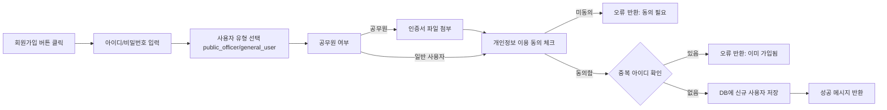

# AUTH00

기능명: 사용자 등록
상태: 시작 전
설명: 공무원/ 일반 사용자를 구분하여 사용자를 등록

### **📌 1. 기능 상세 정보**

- **기능 ID:** `AUTH00`
- **기능명:** 사용자 등록
- **기능 설명**: 아이디-비밀번호 매칭으로 공무원/ 일반 사용자를 구분하여 사용자를 등록. 공무원의 경우, 인증서를 통한 추가 인증이 필요(현재 단계에서는 단순 파일 첨부 기능으로 대체)

---

- **사용자 역할:** 공무원 / 일반 사용자
- **입력값:**
    - `user_id` (필수, string) – 사용자 아이디/이메일
    - `password` (필수, string) – 사용자 비밀번호
    - `user_type` (필수, enum: `public_officer`, `general_user`) – 사용자 유형
    - `terms_agreed` (필수, boolean: true/false) – 이용약관 동의 여부
    - `cert_file` (선택, file) – 공무원 인증서 파일 (공무원인 경우 필수) - 파일 입력 형식으로 대체
- **출력값:**
    - 성공 시: `{ "message": "회원가입 완료", "user_type": "public_officer" }`
    - 실패 시: `{ "error": "에러 메시지" }`

---

### **📌 2. 처리 흐름 (Flowchart)**

---

### **📌 3. 예외 처리**

- ⚠️ 아이디/비밀번호 누락 → `"아이디와 비밀번호를 모두 입력해주세요."`
- ⚠️ 공무원인데 인증서 미첨부 → `"공무원 인증서 파일을 첨부해주세요."`
- ⚠️ 개인정보 동의 미체크 → `"개인정보 이용 동의가 필요합니다."`
- ⚠️ 이미 가입된 아이디 → `"이미 가입된 계정입니다. 로그인 해주세요."`
- ⚠️ 사용자 유형 미선택 → `"사용자 유형을 선택해주세요."`