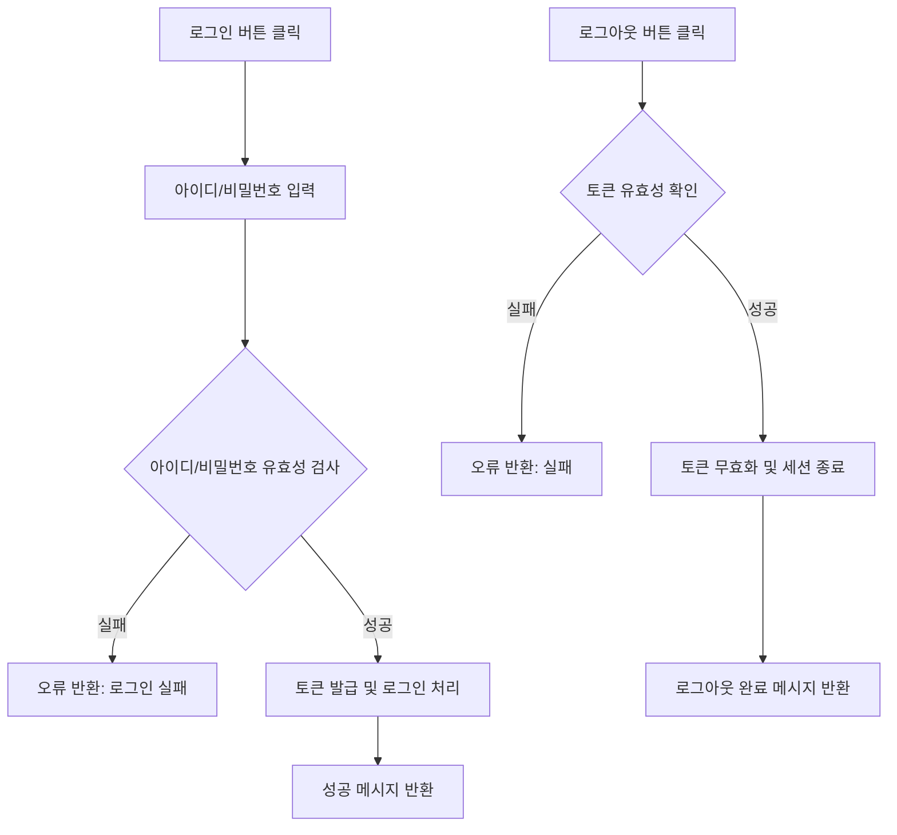

# AUTH01

기능명: 로그인/ 로그아웃
설명: 등록한 아이디와 비밀번호를 활용하여 로그인/ 로그아웃

### **📌 1. 기능 상세 정보**

- **기능 ID:** `AUTH01`
- **기능명:** 로그인 / 로그아웃
- **기능 설명**: 아이디-비밀번호 매칭을 통해 로그인/ 로그아웃. 토큰을 통해 관리

---

- **사용자 역할:** 공무원 / 일반 사용자
- **입력값 (로그인):**
    - `user_id` (필수, string) – 사용자 아이디
    - `password` (필수, string) – 사용자 비밀번호
- **출력값 (로그인):**
    - 성공 시: `{ "message": "로그인 성공", "user_type": "public_officer", "token": "..." }`
    - 실패 시: `{ "error": "에러 메시지" }`
- **입력값 (로그아웃):**
    - `access_token` (필수, string) – 현재 로그인 상태의 토큰
- **출력값 (로그아웃):**
    - 성공 시: `{ "message": "로그아웃 완료" }`
    - 실패 시: `{ "error": "에러 메시지" }`

---

### **📌 2. 처리 흐름 (Flowchart)**

---

### **📌 3. 예외 처리**

- ⚠️ 아이디 또는 비밀번호 불일치 → `"아이디 또는 비밀번호가 올바르지 않습니다."`
- ⚠️ 존재하지 않는 계정 → `"존재하지 않는 계정입니다."`
- ⚠️ 로그아웃 시 유효하지 않은 토큰 → `"올바르지 않은 접근입니다."`
- ⚠️ 로그인 중 서버 오류 → `"서버 오류로 로그인에 실패했습니다. 다시 시도해주세요."`