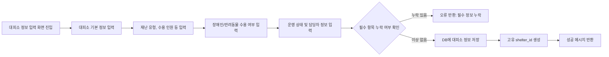

# OFFC00

기능명: 대피소 정보 설정
설명: 발생한 재난, 대피소 규모 등을 사전 등록

### **📌 1. 기능 상세 정보**

- **기능 ID:** `OFFC00`
- **기능명:** 대피소 정보 설정
- **기능 설명:** 공무원이 현재 근무하고 있는 대피소 정보를 설정함. 대피소 명칭, 위치, 재난 유형, 수용 가능 인원 등 핵심 정보를 입력하여 재난 대응에 활용.
- **사용자 역할:** 공무원
- **입력값:**
    - `shelter_name` (필수, string) – 대피소 명칭
    - `location` (필수, string 또는 좌표) – 대피소 주소 또는 위도/경도 좌표
    - `disaster_type` (필수, enum) – 발생 재난 유형 (`지진`, `화재`, `홍수`, `태풍`, `기타`)
    - `capacity` (필수, integer) – 수용 가능 인원 수
    - `current_occupancy` (필수, integer) – 현재 대피 인원 수
    - `has_disabled_facility` (선택, boolean) – 장애인 편의시설 여부
    - `has_pet_zone` (선택, boolean) – 반려동물 수용 가능 여부
    - `status` (필수, enum) – 대피소 운영 상태 (`운영중`, `포화`, `폐쇄`)
    - `contact_person` (필수, string) – 담당자 이름
    - `contact_phone` (필수, string) – 담당자 연락처
- **출력값:**
    - 성공 시: `{ "message": "대피소 정보가 등록되었습니다.", "shelter_id": "SH12345" }`
    - 실패 시: `{ "error": "에러 메시지" }`

---

### **📌 2. 처리 흐름 (Flowchart)**

---

### **📌 3. 예외 처리**

- ⚠️ 필수 항목 누락 → `"필수 항목을 모두 입력해주세요."`
- ⚠️ 연락처 형식 오류 → `"연락처 형식을 확인해주세요. (예: 010-1234-5678)"`
- ⚠️ 수용 인원 입력 오류 → `"수용 가능 인원 및 현재 인원은 숫자만 입력해주세요."`
- ⚠️ DB 저장 실패 → `"서버 오류로 대피소 정보 저장에 실패했습니다."`