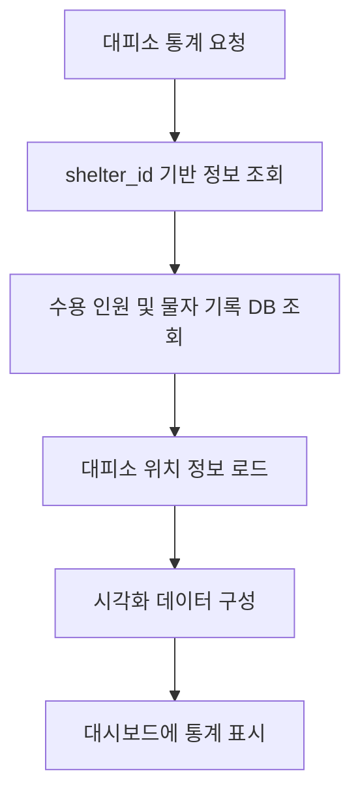

# OFFC01

기능명: 대피소 내 구호품 통계
설명: 대피소에 필요한 물품과 기부 받은 물품, 분배한 물품 등의 통계를 대시보드에 표시

### **📌 1. 기능 상세 정보**

- **기능 ID:** `OFFC01`
- **기능명:** 대피소 내 통계
- **기능 설명:**
    
    공무원이 현재 근무 중인 대피소의 운영 현황을 직관적으로 파악할 수 있도록 주요 통계 정보를 시각화하여 대시보드 형태로 제공. 수용 현황, 구호물자 수급 이력 등을 종합적으로 표시.
    
- **입력값:**
    - `shelter_id` (필수, string) – 조회 대상 대피소 ID
- **출력값 예시:**
    
    ```json
    {
      "shelter_name": "동작구민회관 대피소",
      "capacity": 150,
      "current_occupancy": 97,
      "occupancy_rate": 64.7,
      "relief_items": [
        { "date": "2025-06-17", "requested": 50, "supplied": 30 },
        { "date": "2025-06-18", "requested": 40, "supplied": 40 },
        ...
      ],
      "location": {
        "address": "서울시 동작구 상도로 123",
        "latitude": 37.4932,
        "longitude": 126.9538
      }
    }
    
    ```
    

---

### **📌 2. 처리 흐름 (Flowchart)**



---

### **📌 3. 예외 처리**

- ⚠️ 존재하지 않는 shelter_id → `"해당 대피소 정보를 찾을 수 없습니다."`
- ⚠️ 데이터 조회 실패 → `"서버 오류로 통계 정보를 불러오지 못했습니다."`
- ⚠️ 위치 정보 누락 → `"대피소 위치 정보가 등록되지 않았습니다."`

---

### **📌 4. 시각화 요소**

| 항목 | 설명 |
| --- | --- |
| **수용 가능 인원 vs 현재 수용 인원** | 전체 정원 대비 현재 인원의 비율을 표시 |
| **수급 / 등록 물자 수 기록** | 날짜별 요청 대비 실제 수급량을 비교 |
| **우선 필요 물품 TOP 5** | 현재 재고 대비 부족률이 가장 큰 상위 5개 품목 |
| **재고 소진 예상일** | 현재 소비 속도 기반으로 구호품 소진 예상일 계산 |