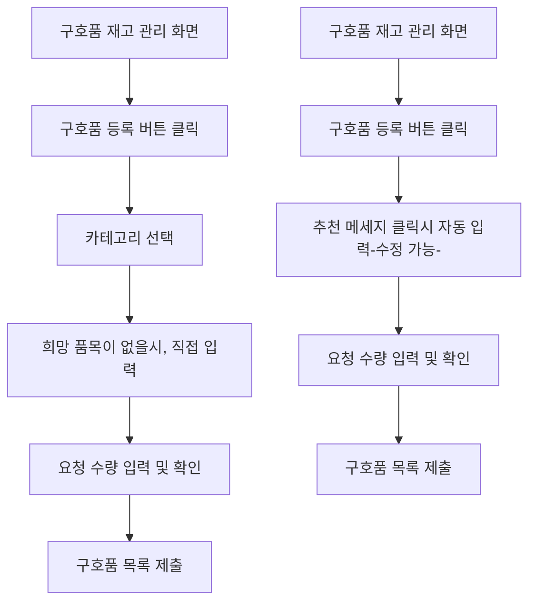

# OFFC02

기능명: 필요 구호품 등록
설명: 현재 대피소에 필요한 구호품을 등록

### **📌 1. 기능 상세 정보**

- **기능 ID:** `OFFC02`
- **기능명:** 필요 구호품 등록
- **기능 설명:**
    
    공무원이 현재 대피소에 필요한 구호품을 등록하여 일반 사용자가 해당 품목을 확인하고 기부하거나 전달할 수 있도록 함.
    
    구호품은 **대분류-중분류-소분류**로 구성되며, 재난 유형 및 수용 인원 정보를 바탕으로 자동 추천 기능(`RECS00`)과 연계
    
- **사용자 역할:** 공무원
- **입력값:**
    - `shelter_id` (필수, string) – 등록 대상 대피소 ID
    - `relief_items` (필수, array) – 요청 구호품 목록
        
        각 항목 구성:
        
        ```json
        {
          "category": "식량",
          "subcategory": "통조림",
          "item": "참치캔",
          "quantity": 100,
          "unit": "개"
        }
        
        ```
        
- **출력값:**
    - 성공 시: `{ "message": "구호품 요청이 등록되었습니다." }`
    - 실패 시: `{ "error": "에러 메시지" }`

---

### **📌 2. 처리 흐름 (Flowchart)**



---

### **📌 3. 예외 처리**

- ⚠️ 필수 항목 누락 → `"필수 정보를 모두 입력해주세요."`
- ⚠️ 수량에 숫자가 아닌 값 입력 → `"수량은 숫자만 입력해야 합니다."`
- ⚠️ 카테고리 미선택 → `"구호품 분류를 모두 선택해주세요."`
- ⚠️ RECS00 응답 실패 시 → `"추천 정보를 불러오는 데 실패했습니다. 직접 입력해주세요."`
- ⚠️ DB 저장 실패 → `"요청 등록 중 오류가 발생했습니다. 다시 시도해주세요."`

### 📦 **구호품 카테고리 예시**

| 대분류 | 중분류 | 소분류 예시 |
| --- | --- | --- |
| **식량** | 즉석식품 | 컵라면, 햇반, 삼각김밥 |
|  | 통조림 | 참치캔, 스팸, 과일통조림 |
|  | 음료 | 생수, 이온음료, 우유 |
| **생활용품** | 위생용품 | 휴지, 물티슈, 칫솔, 치약, 비누 |
|  | 여성용품 | 생리대, 파우치형 청결제 |
|  | 세탁/청소 | 세탁세제, 빨래비누 |
| **의약품** | 일반의약품 | 해열제, 감기약, 소화제 |
|  | 구급용품 | 밴드, 소독약, 붕대 |
|  | 마스크류 | KF94 마스크, 덴탈마스크 |
| **의류** | 방한용품 | 담요, 장갑, 내복, 핫팩 |
|  | 의류 | 티셔츠, 속옷, 양말 |
|  | 아동복 | 아동용 티셔츠, 기저귀 |
| **유아·아동용품** | 유아식 | 분유, 이유식, 아기과자 |
|  | 위생 | 아기물티슈, 기저귀, 크림 |
|  | 기타 요청 | 요청자 직접 입력 항목 |