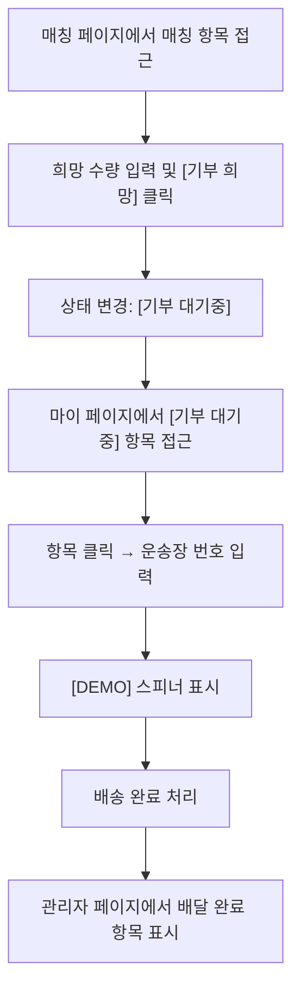

# PACK000

기능명: 구호품 송장 등록 및 조회
설명: 구호품을 배송한 후 송장을 등록하여 조회 및 추적

### **📌 1. 기능 상세 정보[데모 버전으로 구현, 흐름도만 참고해주세요]**

- **기능 ID:** `PACK000`
- **기능명:** 구호품 송장 등록 및 조회
- **기능 설명:**
    
    사용자가 택배 관리 페이지에서 운송장 번호를 등록하고 배송 현황을 실시간/주기적 조회
    
    배송이 완료가 되면 “도착(검수 대기)” 상태로 표시되며, 실제 재고 반영은 `PACK001`에서 관리자가 확정한다.
    
- **사용자 역할:** 일반 사용자(기부자)
- **입력값:**
    - `~~tracking_number` (필수, string) – 운송장 번호~~
    - `~~carrier` (필수, string) – 택배사 코드(예: `kr.cjlogistics`)~~
    - `~~donation_id` (필수, string) – 기부 주문 ID~~
    - `~~shelter_id` (필수, string) – 수령 대피소 ID~~
    - ~~(선택) `items` (array) – 분할배송 대응용(운송장 단위 품목/수량)~~
        
        ```json
        [
          { 
        	  "item_id": "wtr-500",
        	  "name": "생수 500ml",
        	  "quantity": 60,
        	  "unit": "개"
          }
        ]
        
        ```
        
- **출력값:**
    - 성공 시: `{ "message": "운송장이 등록되었습니다." }`
    - 실패 시: `{ "error": "에러 메시지" }`

### **📌 2. 처리 흐름 (Flowchart)**



### **📌 4. 예외 처리**

- ~~⚠️ 형식 오류/미지원 택배사 → `"운송장 번호 또는 택배사 정보를 확인해주세요."`~~
- ~~⚠️ 중복 등록 → `"이미 등록된 운송장입니다."`~~