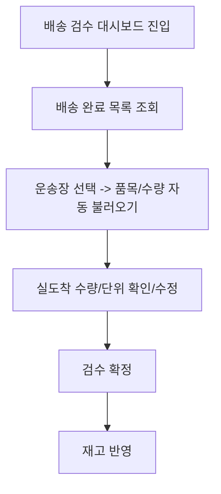

# PACK001

기능명: 배송 검수 및 재고 포함
설명: 배송 완료된 구호품을 재고에 자동으로 포함

### **📌 1. 기능 상세 정보**

- **기능 ID:** `PACK001`
- **기능명:** 배송 완료 검수 및 재고 반영
- **기능 설명:**
    
    관리자가 배송 완료된 운송장들을 모아 확인하고, 실도착 수량·품목을 검수한 뒤 확정 시 `OFFC03` 재고에 반영한다. 파손/분실 등으로 수량 불일치 시 정정할 수 있으며, 반영 후 `OFFC02` 부족/충족 현황과 `RECS00` 추천이 자동 재계산된다.
    
- **사용자 역할:** 공무원(관리자)
- **입력값:**
    - `shelter_id` (필수, string) – 검수 대상 대피소
    - `delivery_id` (필수, string) – 내부 배송 레코드
    - `received_items` (array) – 검수 후 확정 품목·수량
        
        ```json
        [
          {
        	  "item_id": "wtr-500",
        	  "name": "생수 500ml",
        	  "expected_qty": 60,
        	  "received_qty": 58
          }
        ]
        
        ```
        

- **출력값:**
    - 성공 시: `{ "message": "검수 및 재고 반영이 완료되었습니다."}`
    - 실패 시: `{ "error": "에러 메시지" }`

### **📌 2. 처리 흐름 (Flowchart)**



### **📌 3. 예외 처리**

- ⚠️ 항목 누락/형식 오류 → `"필수 정보를 입력해주세요."`
- ⚠️ 수량 입력 오류(음수/비정상 값) → `"수량은 0 이상의 숫자만 입력 가능합니다."`
- ⚠️ 대피소/주문 매핑 불일치 → `"대피소 또는 주문 정보가 일치하지 않습니다."`
- ⚠️ DB/트랜잭션 실패 → `"재고 반영 중 오류가 발생했습니다. 다시 시도해주세요."`
- ⚠️ 중복 반영 방지 실패 시도 → `"이미 반영된 운송장/품목입니다."`