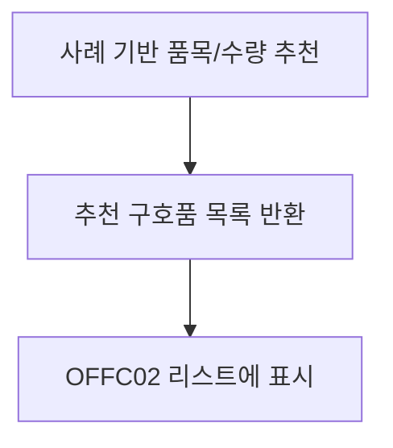

# RECS00

기능명: 대피소 조건 별 구호품 추천
설명: 사전 등록한 대피소 정보에 따라 필요 구호품 추천

**📌 1. 기능 상세 정보**

- **기능 ID:** `RECS00`
- **기능명:** 대피소 조건 별 구호품 추천
- **기능 설명:**
    
    공무원이 입력한 대피소의 조건(재난 유형, 수용 인원 등)을 기반으로, 과거 유사한 재난/대피소 상황에서 사용된 구호품 이력 데이터를 분석해 적절한 **구호품 종류 및 수량**을 추천.
    
    `OFFC02`(필요 구호품 등록)과 연계되어 사전 입력값 기반 자동 추천 리스트를 제공함.
    

---

### **📌 1-1. 입력값**

- 사전 설정한 대피소 정보(담당자 정보, 대피소 이름 제외)

---

### **📌 1-2. 출력값**

```json
{
  "recommended_items": [
    {
      "category": "식량",
      "subcategory": "즉석식품",
      "item": "햇반",
      "quantity": 300,
      "unit": "개"
    },
    {
      "category": "생활용품",
      "subcategory": "위생용품",
      "item": "물티슈",
      "quantity": 200,
      "unit": "개"
    },
    ...
  ]
}

```

---

### **📌 2. 처리 흐름 (Flowchart)**



---

### **📌 3. 예외 처리**

⚠️ 내부 계산 실패/타임아웃 → `"추천 계산 중 오류가 발생했습니다. 다시 시도해주세요."`

---