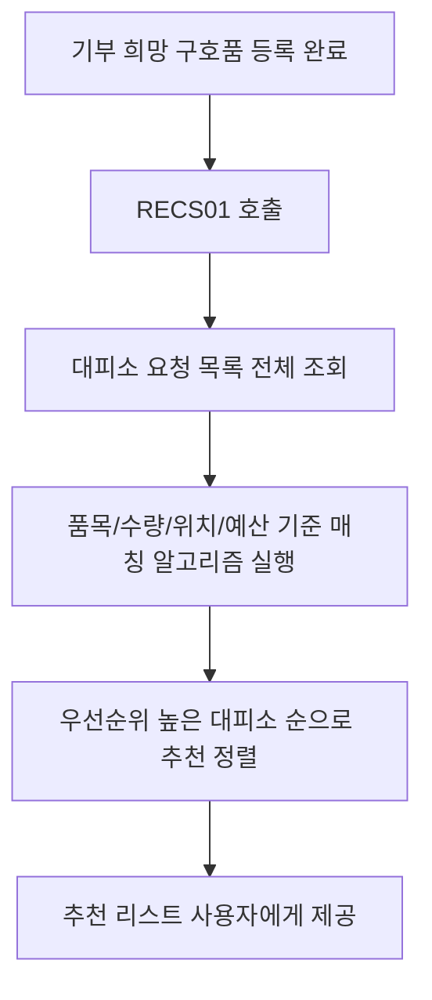

# RECS01

기능명: 수요 구호품-기부 희망 구호품 매칭
설명: 기부하고 싶은 구호품과 수요로 하는 구호품을 매칭

### **📌 1. 기능 상세 정보**

- **기능 ID:** `RECS01`
- **기능명:** 수요 구호품–기부 희망 구호품 매칭
- **기능 설명:**
    
    일반 사용자가 등록한 기부 희망 구호품 목록과 전국 대피소의 요청 구호품 목록을 비교하여 기부자가 가장 효과적으로 도울 수 있는 대피소를 자동 추천함.
    
    기부 수량, 품목 등을 고려하여 가장 시급하고 적합한 보호소를 매칭해주는 기능.
    
- **사용자 역할:** 일반 사용자
- **입력값:**
    - `user_id` (필수, string) – 기부자 식별자
    - `relief_items` (선택, array) – 기부 희망 구호품 목록
        
        예시:
        
        ```json
        [
          {
            "item": "컵라면",
            "quantity": 20
          },
          {
            "item": "물티슈",
            "quantity": 50
          }
        ]
        
        ```
        
    - `budget` (선택, number) – 기부자가 설정한 총 예산 (단위: 원)
- **출력값:**
    
    ```json
    {
      "matched_shelters": [
        {
          "shelter_id": "SH12345",
          "shelter_name": "동작구민회관 대피소",
          "matched_items": [
            { "item": "컵라면", "requested": 50, "matched": 20 }
          ],
          "urgency_score": 92.5
        },
        {
          "shelter_id": "SH67890",
          "shelter_name": "은평초등학교 체육관",
          "matched_items": [
            { "item": "물티슈", "requested": 100, "matched": 50 }
          ],
          "urgency_score": 81.3
        }
      ]
    }
    
    ```
    

---

### **📌 2. 처리 흐름 (Flowchart)**



---

### **📌 3. 예외 처리**

- ⚠️ 시스템 오류 → `"매칭 과정에서 문제가 발생했습니다. 다시 시도해주세요."`