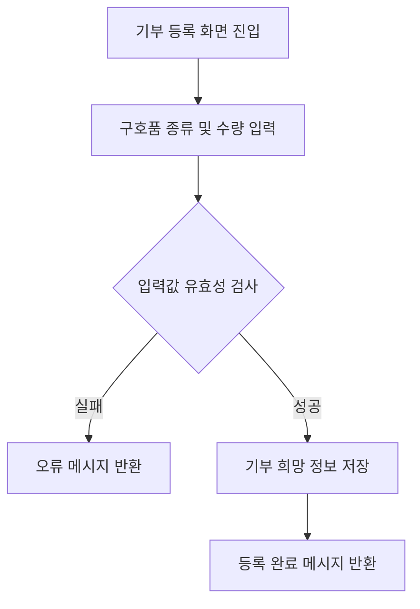

# USER00

기능명: 기부 희망 구호품 등록
설명: 현재 내가 기부하고 싶은 구호품 종류와 양을 등록

### **📌 1. 기능 상세 정보**

- **기능 ID:** `USER00`
- **기능명:** 기부 희망 구호품 등록
- **기능 설명:**
    
    일반 사용자가 기부하고자 하는 구호품의 종류와 수량, 예산 등을 등록함. 시스템은 해당 기부 정보와 현재 대피소의 필요 구호품 정보를 매칭(RECS01에 활용)
    
- **사용자 역할:** 일반 사용자
- **입력값:**
    - `user_id` (필수, string) – 기부자 식별용 사용자 ID
    - `relief_items` (선택, array) – 기부 희망 구호품 목록
        
        각 항목 구성:
        
        ```json
        {
          "category": "식량",
          "subcategory": "즉석식품",
          "item": "컵라면",
          "quantity": 20,
          "unit": "개"
        }
        ```
        
- **출력값:**
    - 성공 시: `{ "message": "기부 희망 구호품이 등록되었습니다." }`
    - 실패 시: `{ "error": "에러 메시지" }`

---

### **📌 2. 처리 흐름 (Flowchart)**



---

### **📌 3. 예외 처리**

- ⚠️ 필수 항목 누락 → `"기부 물품 정보는 필수입니다."`
- ⚠️ 수량 또는 예산 형식 오류 → `"수량과 예산은 숫자 형식으로 입력해야 합니다."`
- ⚠️ 카테고리 또는 품목 누락 → `"카테고리 및 품목을 선택해주세요."`
- ⚠️ DB 저장 실패 → `"기부 등록 중 오류가 발생했습니다. 다시 시도해주세요."`