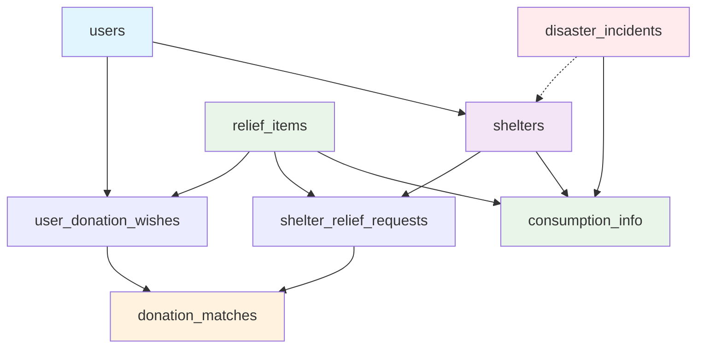

# 이어드림 데이터 스키마 구조

## 1. 플랫폼 개요

이어드림은 재난 상황에서 대피소와 구호품 기부자를 연결하는 AI 기반 매칭 플랫폼입니다.

### 1.1 핵심 기능

* 실시간 대피소 현황 모니터링 (전국 22,000개 실제 대피소 데이터 기반)

* AI 기반 구호품 수요 예측

* 스마트 매칭 알고리즘을 통한 기부자-대피소 연결

* 개인화된 추천 시스템

* 배송 및 물류 최적화

### 1.2 AI/ML 모델 요구사항

* **다변량 LSTM 모델**: 대피소별 구호품 수요 예측

* **트위터 오픈소스 추천 알고리즘**: 사용자 맞춤형 기부 추천

* **실시간 분석**: 대피소 현황 및 긴급도 분석

### 1.3 실제 데이터 통합

* **정부 API 연동**: 전국 대피소 약 22,000개 실제 데이터 활용
* **실시간 업데이트**: 대피소 운영 상태, 수용 현황 실시간 반영
* **지리적 정확성**: 실제 좌표 기반 위치 서비스 제공

## 📊 데이터 생성 도구

### 🏠 실제 대피소 데이터 + 가상 테스트 데이터

프로젝트는 **실제 정부 API 대피소 데이터(~22,000개)**와 **가상 테스트 데이터**를 결합하여 완전한 개발/테스트 환경을 제공합니다.

**빠른 시작**:
```powershell
# 실제 대피소 데이터 + 가상 데이터 통합 생성
python tools\generate_fake_data.py --real_shelter_csv "tools\대피소추가_API\shelter_schema_전국.csv" --users 100 --relief_items 50

# 간편 실행
python tools\example_generate_with_real_data.py
```

**자세한 사용법**: [`tools/README_FAKE_DATA.md`](tools/README_FAKE_DATA.md) 참고

## 2. 데이터 테이블 구조 개요

### 2.1 테이블 관계도



## 3. 핵심 데이터 테이블 구조

### 3.1 users 테이블

| Key                   | Value Type | Description                                 | Example               |
| --------------------- | ---------- | ------------------------------------------- | --------------------- |
| user\_id              | string     | 사용자 고유 ID                                   | "user\_0001"          |
| email                 | string     | 이메일 주소                                      | "<user@example.com>"  |
| user\_type            | string     | 사용자 유형 (public\_officer/general\_user)      | "general\_user"       |
| name                  | string     | 사용자 이름                                      | "홍길동"                 |
| phone\_number         | string     | 전화번호                                        | "010-1234-5678"       |
| zipcode               | string     | 우편번호                                        | "12345"               |
| road\_address         | string     | 도로명 주소                                      | "서울시 강남구 테헤란로 123"    |
| address\_detail       | string     | 상세 주소                                       | "456호"                |
| preferred\_categories | string     | 선호 카테고리 (쉼표 구분)\[한번이라도 기부한 물품 카테고리들(추천시스템)] | "식량,생활용품"             |
| created\_at           | datetime   | 생성일시                                        | "2024-01-15 10:30:00" |
| updated\_at           | datetime   | 수정일시                                        | "2024-01-15 10:30:00" |
| last\_login\_at       | datetime   | 마지막 로그인 일시                                  | "2024-01-15 10:30:00" |

### 3.2 shelters 테이블 🏠 **실제 정부 API 데이터 (~22,000개)**

| Key                     | Value Type | Description           | Example                 |
| ----------------------- | ---------- | --------------------- | ----------------------- |
| shelter\_id             | string     | 대피소 고유 ID             | "SH_000001"    |
| manager\_id             | string     | 관리자 ID (users 테이블 참조) | "user\_0000"            |
| shelter\_name           | string     | 대피소 이름                | "강남구 체육관"               |
| disaster\_type          | string     | 재난 유형                 | "지진"                    |
| status                  | string     | 운영 상태 (운영중/포화/폐쇄)     | "운영중"                   |
| address                 | string     | 주소                    | "서울시 강남구 테헤란로 456"      |
| latitude                | float      | 위도 (실제 좌표)            | 37.5173                 |
| longitude               | float      | 경도 (실제 좌표)            | 127.0473                |
| total\_capacity         | integer    | 총 수용 인원               | 200                     |
| current\_occupancy      | integer    | 현재 수용 인원 (초기값: 0)     | 0                       |
| occupancy\_rate         | float      | 수용률 (초기값: 0.0)        | 0.0                     |
| has\_disabled\_facility | boolean    | 장애인 시설 보유 여부          | true                    |
| has\_pet\_zone          | boolean    | 반려동물 구역 보유 여부         | false                   |
| amenities               | string     | 편의시설 (쉼표 구분)          | "의료실,급식실,샤워실"           |
| contact\_person         | string     | 담당자 이름                | "김관리"                   |
| contact\_phone          | string     | 담당자 전화번호              | "02-1234-5678"          |
| contact\_email          | string     | 담당자 이메일               | "<shelter@example.com>" |
| total\_requests         | integer    | 총 요청 수 (초기값: 0)       | 0                       |
| fulfilled\_requests     | integer    | 완료된 요청 수 (초기값: 0)     | 0                       |
| pending\_requests       | integer    | 대기 중인 요청 수 (초기값: 0)   | 0                       |
| created\_at             | datetime   | 생성일시                  | "2024-01-15 10:30:00"   |
| updated\_at             | datetime   | 수정일시                  | "2024-01-15 10:30:00"   |

> **📍 실제 데이터 특징**: 
> - **전국 약 22,000개** 실제 대피소 정보
> - **정확한 위치 좌표** 및 실제 시설 정보
> - **실시간 운영 상태** 반영 가능
> - **운영 데이터 초기화**: 개발/테스트용으로 occupancy 관련 필드는 0으로 설정

### 3.3 relief\_items 테이블

| Key                 | Value Type | Description | Example               |
| ------------------- | ---------- | ----------- | --------------------- |
| item\_id            | string     | 구호품 고유 ID   | "relief\_item\_001"   |
| item\_code          | string     | 구호품 코드      | "FOOD\_001"           |
| category            | string     | 대분류         | "식량"                  |
| subcategory         | string     | 소분류         | "즉석식품"                |
| item\_name          | string     | 구호품 이름      | "컵라면"                 |
| description         | string     | 구호품 설명      | "식량 > 즉석식품 > 컵라면"     |
| unit                | string     | 단위          | "개"                   |
| created\_at         | datetime   | 생성일시        | "2024-01-15 10:30:00" |
| updated\_at         | datetime   | 수정일시        | "2024-01-15 10:30:00" |

### 3.4 user\_donation\_wishes 테이블

| Key                      | Value Type | Description                   | Example                     |
| ------------------------ | ---------- | ----------------------------- | --------------------------- |
| wish\_id                 | string     | 기부 의사 고유 ID                   | "wish\_001"                 |
| user\_id                 | string     | 사용자 ID (users 테이블 참조)         | "user\_0001"                |
| relief\_item\_id         | string     | 구호품 ID (relief\_items 테이블 참조) | "relief\_item\_001"         |
| quantity                 | integer    | 기부 수량                         | 50                          |
| status                   | string     | 상태 (대기중/매칭완료/배송중/완료/취소)       | "대기중"                       |
| matched\_request\_ids    | string     | 매칭된 요청 ID들 (쉼표 구분)            | "request\_001,request\_002" |
| total\_matched\_quantity | integer    | 총 매칭된 수량                      | 30                          |
| remaining\_quantity      | integer    | 남은 수량                         | 20                          |
| created\_at              | datetime   | 생성일시                          | "2024-01-15 10:30:00"       |
| updated\_at              | datetime   | 수정일시                          | "2024-01-15 10:30:00"       |
| expires\_at              | datetime   | 만료일시                          | "2024-01-22 10:30:00"       |

### 3.5 shelter\_relief\_requests 테이블

| Key                      | Value Type | Description                   | Example               |
| ------------------------ | ---------- | ----------------------------- | --------------------- |
| request\_id              | string     | 구호품 요청 고유 ID                  | "request\_001"        |
| shelter\_id              | string     | 대피소 ID (shelters 테이블 참조)      | "shelter\_001"        |
| relief\_item\_id         | string     | 구호품 ID (relief\_items 테이블 참조) | "relief\_item\_001"   |
| requested\_quantity      | integer    | 요청 수량                         | 100                   |
| current\_stock           | integer    | 현재 재고                         | 20                    |
| urgent\_quantity         | integer    | 긴급 필요 수량                      | 50                    |
| urgency\_level           | string     | 긴급도 (높음/중간/낮음)                | "높음"                  |
| needed\_by               | datetime   | 필요 시점                         | "2024-01-20 18:00:00" |
| status                   | string     | 상태 (대기중/매칭완료/배송중/완료/취소)       | "대기중"                 |
| notes                    | string     | 조건/메모                         | "어린이용 우선 필요"          |
| matched\_wish\_ids       | string     | 매칭된 기부 의사 ID들 (쉼표 구분)         | "wish\_001,wish\_002" |
| total\_matched\_quantity | integer    | 총 매칭된 수량                      | 60                    |
| remaining\_quantity      | integer    | 남은 필요 수량                      | 40                    |
| created\_at              | datetime   | 생성일시                          | "2024-01-15 10:30:00" |
| updated\_at              | datetime   | 수정일시                          | "2024-01-15 10:30:00" |

### 3.6 donation\_matches 테이블

| Key                     | Value Type | Description                                  | Example               |
| ----------------------- | ---------- | -------------------------------------------- | --------------------- |
| match\_id               | string     | 매칭 고유 ID                                     | "match\_001"          |
| donation\_wish\_id      | string     | 기부 의사 ID (user\_donation\_wishes 테이블 참조)     | "wish\_001"           |
| relief\_request\_id     | string     | 구호품 요청 ID (shelter\_relief\_requests 테이블 참조) | "request\_001"        |
| matched\_quantity       | integer    | 매칭된 수량                                       | 30                    |
| donor\_id               | string     | 기부자 ID                                       | "user\_001"           |
| shelter\_id             | string     | 대피소 ID                                       | "shelter\_001"        |
| relief\_item\_id        | string     | 구호품 ID                                       | "relief\_item\_001"   |
| status                  | string     | 상태 (매칭완료/배송중/배송완료/검수완료/취소)                   | "매칭완료"                |
| matched\_at             | datetime   | 매칭 완료 일시                                     | "2024-01-15 10:30:00" |
| delivery\_scheduled\_at | datetime   | 배송 예정 일시                                     | "2024-01-16 14:00:00" |
| delivery\_completed\_at | datetime   | 배송 완료 일시                                     | "2024-01-16 16:30:00" |
| verified\_at            | datetime   | 검수 완료 일시                                     | "2024-01-16 17:00:00" |
| delivery\_company       | string     | 택배사                                          | "한진택배"                |
| tracking\_number        | string     | 운송장 번호                                       | "TRACK123456"         |
| delivery\_address       | string     | 배송 주소                                        | "서울시 강남구 테헤란로 456"    |
| created\_at             | datetime   | 생성일시                                         | "2024-01-15 10:30:00" |
| updated\_at             | datetime   | 수정일시                                         | "2024-01-15 10:30:00" |

### 3.7 disaster\_incidents 테이블

| Key                         | Value Type | Description              | Example                     |
| --------------------------- | ---------- | ------------------------ | --------------------------- |
| incident\_id                | string     | 재난 사건 고유 ID              | "incident\_001"             |
| disaster\_year              | string     | 재난 발생 연도                 | "2024"                      |
| ndms\_disaster\_type\_code  | string     | NDMS 재난 유형 코드            | "NDMS\_001"                 |
| disaster\_serial\_number    | string     | 재난 일련번호                  | "2024123456"                |
| region\_code                | string     | 지역 코드                    | "RGN\_11680"                |
| damage\_date                | date       | 피해 발생 날짜                 | "2024-01-15"                |
| damage\_time                | time       | 피해 발생 시간                 | "14:30:00"                  |
| damage\_level               | string     | 피해 심각도 (1-5, 1:경미, 5:심각) | "3"                         |
| dong\_code                  | string     | 행정동 코드                   | "68010"                     |
| detail\_address             | string     | 상세 주소                    | "강남구 테헤란로 123번지"            |
| road\_address\_code         | string     | 도로명 주소 코드                | "ROAD\_123456"              |
| road\_detail\_address       | string     | 도로명 상세 주소                | "서울시 강남구 테헤란로 123길 45"      |
| latitude                    | float      | 위도                       | 37.5173                     |
| longitude                   | float      | 경도                       | 127.0473                    |
| affected\_area              | float      | 피해 면적 (km²)              | 15.5                        |
| estimated\_affected\_people | integer    | 예상 피해 인원                 | 500                         |
| related\_shelter\_ids       | string     | 관련 대피소 ID들 (쉼표 구분)       | "shelter\_001,shelter\_002" |
| first\_registered\_at       | datetime   | 최초 등록 일시                 | "2024-01-15 14:45:00"       |
| last\_modified\_at          | datetime   | 최종 수정 일시                 | "2024-01-15 16:20:00"       |
| created\_at                 | datetime   | 생성일시                     | "2024-01-15 14:45:00"       |
| updated\_at                 | datetime   | 수정일시                     | "2024-01-15 16:20:00"       |

### 3.8 consumption\_info 테이블

| Key                         | Value Type | Description                           | Example               |
| --------------------------- | ---------- | ------------------------------------- | --------------------- |
| consumption\_id             | string     | 소비 정보 고유 ID                           | "consumption\_001"    |
| shelter\_id                 | string     | 대피소 ID (shelters 테이블 참조)              | "shelter\_001"        |
| disaster\_incident\_id      | string     | 재난 사건 ID (disaster\_incidents 테이블 참조) | "incident\_001"       |
| relief\_item\_id            | string     | 구호품 ID (relief\_items 테이블 참조)         | "relief\_item\_001"   |
| consumed\_quantity          | integer    | 소비된 수량                                | 150                   |
| start\_date                 | date       | 소비 시작 날짜                              | "2024-01-15"          |
| end\_date                   | date       | 소비 종료 날짜                              | "2024-01-22"          |
| duration\_days              | integer    | 소비 기간 (일)                             | 7                     |
| daily\_consumption\_rate    | float      | 일일 평균 소모량                             | 21.4                  |
| peak\_consumption\_day      | integer    | 최대 소모일 (기간 내 몇 번째 날)                  | 3                     |
| peak\_consumption\_quantity | integer    | 최대 소모량                                | 35                    |
| remain\_item                | integer    | 잔여 수량                                 | 12                    |
| shelter\_occupancy          | integer    | 해당 기간 평균 수용 인원                        | 180                   |
| occupancy\_rate             | float      | 수용률                                   | 0.85                  |
| disaster\_severity          | string     | 재난 심각도 (낮음/중간/높음)                     | "높음"                  |
| weather\_conditions         | string     | 날씨 조건 (더위/추위/비/눈/일반)                  | "추위"                  |
| special\_circumstances      | string     | 특수 상황 (쉼표 구분)                         | "어린이 다수,고령자 포함"       |
| waste\_rate                 | float      | 폐기율 (0-1)                             | 0.05                  |
| satisfaction\_score         | float      | 만족도 (1-5)                             | 4.2                   |
| adequacy\_level             | string     | 적정성 수준 (부족/적정/충분/과다)                  | "충분"                  |
| restock\_frequency          | integer    | 해당 기간 내 재보급 횟수                        | 2                     |
| seasonality                 | string     | 계절성 (봄/여름/가을/겨울)                      | "겨울"                  |
| children\_ratio             | float      | 어린이 비율                                | 0.25                  |
| elderly\_ratio              | float      | 고령자 비율                                | 0.15                  |
| disabled\_ratio             | float      | 장애인 비율                                | 0.08                  |
| accessibility\_score        | float      | 접근성 점수 (1-5)                          | 3.5                   |
| distribution\_efficiency    | float      | 배급 효율성 (0-1)                          | 0.85                  |
| recorded\_by                | string     | 기록자 ID                                | "user\_0101"          |
| created\_at                 | datetime   | 생성일시                                  | "2024-01-15 10:30:00" |
| updated\_at                 | datetime   | 수정일시                                  | "2024-01-15 10:30:00" |

