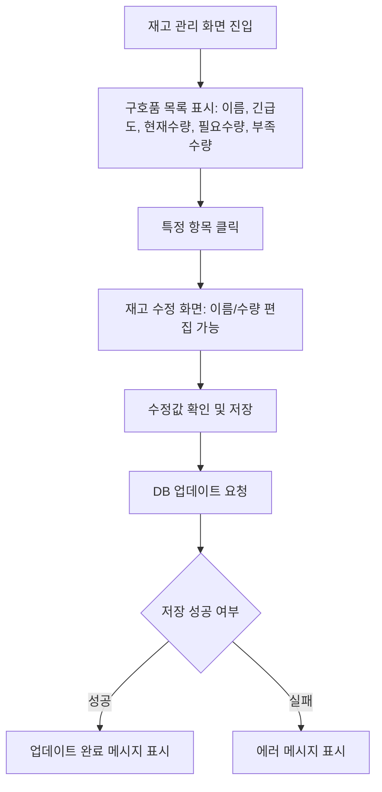

# OFFC03

기능명: 구호품 현황 재고 관리
설명: 현재 대피소에 있는 구호품 재고 관리

### **📌 1. 기능 상세 정보**

- **기능 ID:** `OFFC03`
- **기능명:** 현재 구호품 재고 관리
- **기능 설명:**
    
    공무원이 현재 대피소 내 보관 중인 구호품 재고를 확인하고 관리할 수 있는 기능.
    
    각 항목별로 **구호품 이름, 긴급도, 현재 수량, 예상 필요 수량, 부족 수량**을 표시하며, 특정 항목을 클릭하면 이름이나 수량을 직접 수정할 수 있음.
    
    이 기능은 `OFFC02`(필요 구호품 등록) 및 `RECS00`(자동 추천) 기능과 연계
    
- **사용자 역할:** 공무원
- **입력값:**
    - `shelter_id` (필수, string) – 조회/관리할 대피소 ID
    - `inventory_items` (array) – 구호품 재고 목록
        
        각 항목 구성 예시:
        
        ```json
        {
          "item_id": "item123",
          "name": "생수",
          "urgency": "높음",
          "current_quantity": 120,
          "expected_quantity": 200,
          "shortage_quantity": 80,
        }
        
        ```
        
- **출력값:**
    - 성공 시: `{ "message": "재고 정보가 업데이트되었습니다." }`
    - 실패 시: `{ "error": "에러 메시지" }`

---

### **📌 2. 처리 흐름 (Flowchart)**



---

### **📌 3. 예외 처리**

- ⚠️ 필수 값(`shelter_id`, `item_id`) 누락 → `"필수 정보를 입력해주세요."`
- ⚠️ 수량 입력 오류 (음수, 문자열 등) → `"수량은 0 이상의 숫자만 입력 가능합니다."`
- ⚠️ 존재하지 않는 항목 수정 시도 → `"존재하지 않는 구호품입니다."`
- ⚠️ DB 저장 실패 → `"재고 업데이트 중 오류가 발생했습니다. 다시 시도해주세요."`

---

## 📌 **긴급도 기준**

| 긴급도 | 정량 기준 (충족률) | 표시 방식 |
| --- | --- | --- |
| **높음 🔴** | 현재 수량이 예상 필요 수량의 **50% 미만** | 빨간색 태그 + 경고 아이콘 |
| **중간 🟠** | 현재 수량이 예상 필요 수량의 **50~80%** | 주황색 태그 |
| **낮음 🟢** | 현재 수량이 예상 필요 수량의 **80% 이상** | 초록색 태그 |